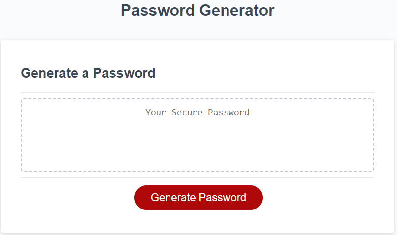

# ch03-password-generator

## Description
This is a project to generate passwords from 8 to 128 characters long and allowing the user to select what types of characters are included.
I built this project to challenge myself to find an easy way to pick a random character in Javascript. So without having to develop a multitude of permutations for each set of selected characteristics it was prudent to test each string of possibilities only once and then concatinate the reference string to to the possibilities pool string one at a time. Thus I avoided having to create an algorithm for each set of predetermined numbers in unicode.
This program is a step toward solving the problem of human generated passwords and the security vulnerabilities they create. Random characters are much harder to crack than dictionary words with a few extra characters.
I learned some basic approaches to this type of problem and I was able work on my basic JavaScript as well.

## Usage

Use of this application is very simple push the "Generate Password" button Then follow the prompts to add the number of characters you want in the password. Select what the password will be composed of lowercase letters, uppercase letters, numbers, and/or special characters.

## Credits

The University of Minnesota coding bootcamp provided the index.html, style.css, and the first few lines of JavaScript. Generate password function was programmed by Matthew Malone matthewmalone3 at gmail.

## License

MIT standard for my portions of the code.
